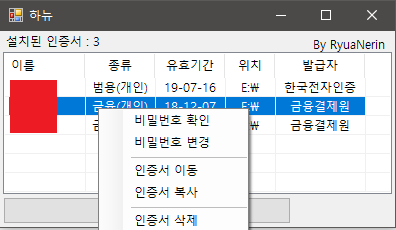

# 하뉴

공인인증서 복사 / 삭제 / 비밀번호 변경 프로그램

# [최신 릴리즈 다운로드](https://github.com/RyuaNerin/Hanyu/releases/latest)

# 설명

- 귀찮은 ActiveX 설치하면서 공인인증서 복사/삭제/**비밀번호 변경** 을 할 필요가 없습니다.

- **특수문자, 영문+숫자 등 모든 제한 조건이 없이 자유롭게 공인인증서 비밀번호를 변경할 수 있습니다**

- 물론 개인적으로 필요해서 만들었습니다

- 이 프로그램 혹은 소스 코드의 사용에 대한 책임은 모두 사용자에게 있습니다

- 이 프로그램으로 인한 데이터의 유실 또는 손상에 대해 책임을 지지 않습니다

# 활용 용도

1. 공인인증서 발급

2. 암호를 소문자+대문자+특수문자+숫자 가 포함된 비밀번호(`A`) 로 설정

3. **하뉴** 실행 후 인증서 우클릭

4. 비밀번호 변경

5. 비밀번호 `A` 를 입혁 후

6. 원하는 비밀번호 입력 (비밀번호 길이/조건 제한 없음)

    - **일부 모바일 앱에서는 8자 이상을 오구하므로 8자 이상으로 설정하시는걸 추천합니다**

7. 모바일로 인증서 복사

# [LICENSE : GPL v3](LICENSE)
